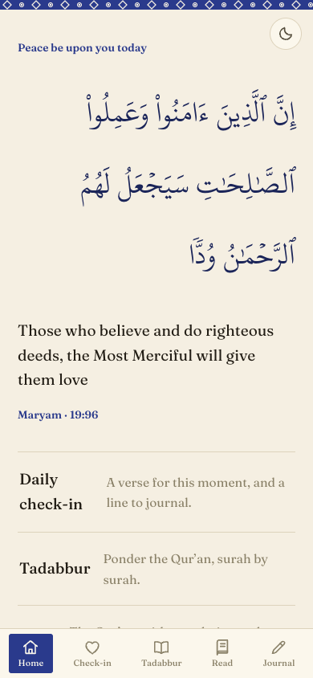
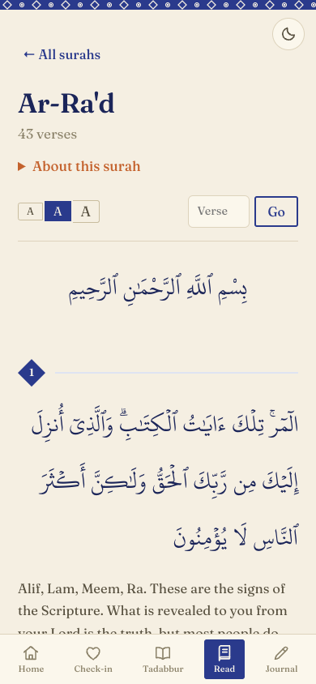
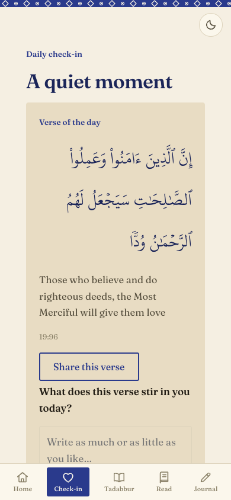
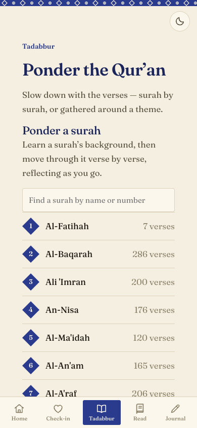
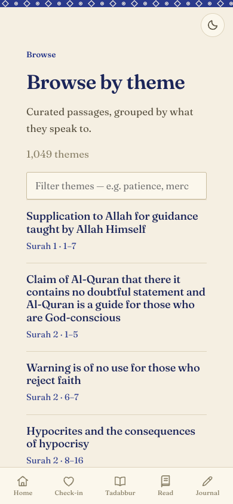
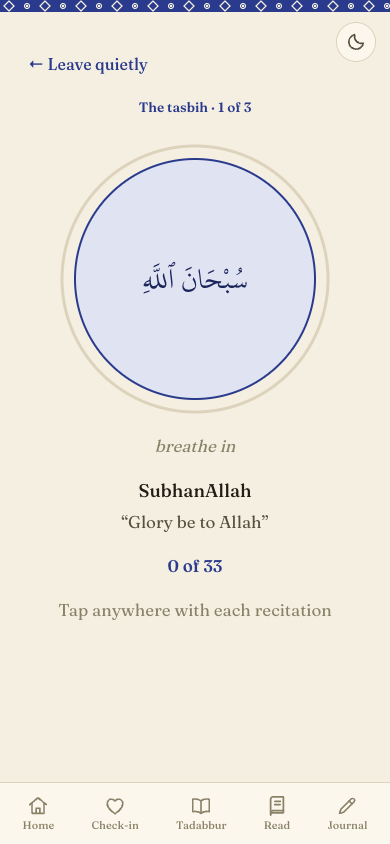

# MindfulVerse

A quiet app for reflecting on the Qur'an. Read verses with translation and
commentary, sit with a short guided reflection, and keep a private journal.

Built as a web app that works offline. This is an early version (v0) — free,
no login, no payments.

## Features

- **Daily check-in** — a verse for today, a gentle mood picker, and a place to journal.
- **Tadabbur sessions** — 20 short guided reflections: a theme, a few verses, and a prompt.
- **Read** — all 114 surahs with Arabic, English translation, and Ibn Kathir's commentary.
- **Dhikr & breath** — remembrance paced to your breath: a breathing circle, tap counting,
  Arabic with transliteration and meaning.
- **Journal** — your reflections, saved on your device.

All Qur'an text, translation, and commentary are shown as-is. The app never
rewrites or generates religious content.

## Screenshots

| Home | Reader | Daily check-in |
| --- | --- | --- |
|  |  |  |

| Tadabbur sessions | Browse by theme | Dhikr & breath |
| --- | --- | --- |
|  |  |  |

## Run it

```bash
npm install
npm run build:data   # build the Qur'an data files
npm run dev          # open the app locally
```

Other commands: `npm run build` (production build), `npm run preview` (view the build).

## How it's built

- **Stack:** React + TypeScript + Vite, with an offline service worker (PWA).
- **No server.** All data is bundled; the journal lives in your browser.
- **Data** is generated by `scripts/build-data.mjs` into `public/data/`.

```text
src/lib/       data loaders, journal, analytics
src/pages/     the screens (Home, Check-in, Sessions, Reader, Journal)
scripts/       build-data.mjs — turns raw datasets into app data
public/data/   generated Qur'an, tafsir, themes, sessions, emotions
raw-data/      source datasets (not committed)
```

To change the data, update the files in `raw-data/`, edit `scripts/build-data.mjs`
if needed, and run `npm run build:data` again.

## Acknowledgments

The Qur'anic datasets that power MindfulVerse — the Uthmani text, Ibn Kathir's
tafsir, ayah themes, surah information, and recitation timing data — come from
the [Quranic Universal Library (QUL)](https://qul.tarteel.ai) by
[Tarteel](https://tarteel.ai). This app would not exist without their work of
making Qur'an data open and accessible. The English translation is Yusuf Ali
(public domain), and the Arabic typeface is the KFGQPC Uthmanic Hafs script
from the King Fahd Glorious Qur'an Printing Complex, Madinah.

## Good to know

- The English translation is Yusuf Ali (public domain, a little old-fashioned).
- Ibn Kathir's commentary is grouped, so some verses don't show a note of their own.
- Recitation audio, accounts, payments, and more languages are planned for later.
